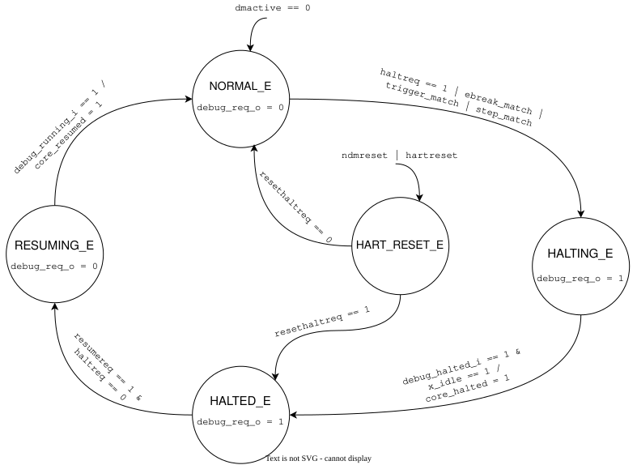

# `meds_s1_run_ctrl`

| | |
|---|---|
| **Status** | COMPLETE |
| **Owner** | [husnainjatoi](https://www.github.com/husnainjatoi) |
| **Backup** | [MuhammadYousaf79](https://github.com/MuhammadYousaf79) |
| **Project** | R-06 |
| **Spec** | SPEC §13, INTERFACES.md §7 |
| **Source** | `rtl/debug/meds_s1_run_ctrl.sv` |
| **Testbench** | `verif/unit/tb_meds_s1_run_ctrl.sv` |

## Purpose

FSM to manage the execution state of the hart (running, halting, resuming). It safely coordinates halt requests, hardware triggers, and single-step matches with the core's completion buffer to ensure precise debug entry.

## Interface contract

| Signal | Dir | Width | Meaning | Contract |
|---|---|---|---|---|
| `clk_i` | in | 1 | clock | single domain |
| `rst_ni` | in | 1 | reset | async assert, sync de-assert |
| `dmactive_i` | in | 1 | debug module active | highest priority override; forces NORMAL_E when low |
| `ndmreset_i` | in | 1 | non-debug reset | overrides FSM to HART_RESET_E |
| `hartreset_i` | in | 1 | hart reset | overrides FSM to HART_RESET_E |
| `haltreq_i` | in | 1 | halt request | triggers halt sequence |
| `resumereq_i` | in | 1 | resume request | triggers resume sequence |
| `resethaltreq_i` | in | 1 | reset halt request | halts immediately out of reset |
| `ebreak_match_i` | in | 1 | ebreak match | triggers halt sequence |
| `trigger_match_i` | in | 1 | trigger match | triggers halt sequence |
| `step_match_i` | in | 1 | step match | triggers halt sequence |
| `debug_halted_i` | in | 1 | core halted | feedback from core |
| `x_idle_i` | in | 1 | core idle | required to finalize halt |
| `debug_running_i` | in | 1 | core running | feedback from core |
| `debug_req_o` | out | 1 | debug request | asserts high to halt core |
| `core_halted_o` | out | 1 | core halted pulse | Mealy pulse on halt completion |
| `core_resumed_o` | out | 1 | core resumed pulse| Mealy pulse on resume completion |

**Handshake:** Transition to `HALTED_E` waits for both `debug_halted_i` and `x_idle_i`. Transition to `NORMAL_E` waits for `debug_running_i`.
**Latency:** Variable based on completion buffer drain time (`x_idle_i`).
**Backpressure:** Core execution is stalled when `debug_req_o` is asserted.
**Reset state:** Enters `NORMAL_E` (if `dmactive_i` is high), all outputs default to `0`.

## Parameters

| Parameter | Default | Legal range | Effect |
|---|---|---|---|
| None | | | |

## Behaviour

The FSM implements five states: `NORMAL_E`, `HALTING_E`, `HALTED_E`, `RESUMING_E`, and `HART_RESET_E`. Global overrides (`dmactive_i`, `ndmreset_i`, `hartreset_i`) take priority over the FSM flow. During the `HALTING_E` phase, the controller waits for the core's completion buffer to drain completely (`x_idle_i`) before officially transitioning to `HALTED_E`. `core_halted_o` and `core_resumed_o` are driven as Mealy pulses during state transitions.

## Exceptions and errors

None raised by this module. Invalid concurrent requests (e.g., `haltreq_i` and `resumereq_i` simultaneously) are resolved safely by prioritizing the halt state.

## Verification status

| Layer | Status | Where |
|---|---|---|
| Lint | | |
| Unit test | 16 checks | `verif/unit/tb_meds_s1_run_ctrl.sv` |
| Co-simulation | not applicable | |
| Formal | | |

## Known limitations

None.

## Open questions

None.